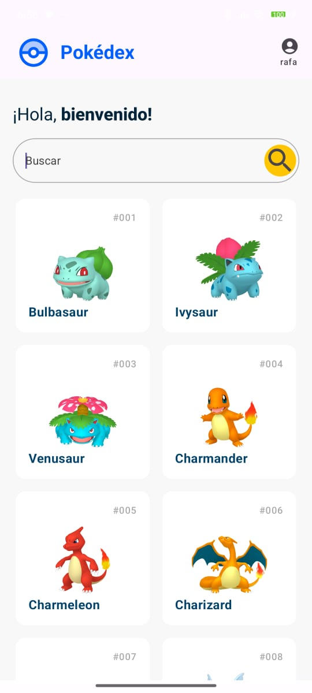
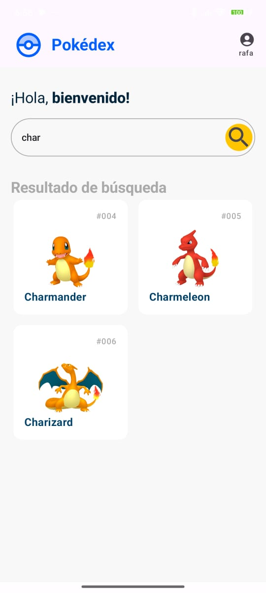
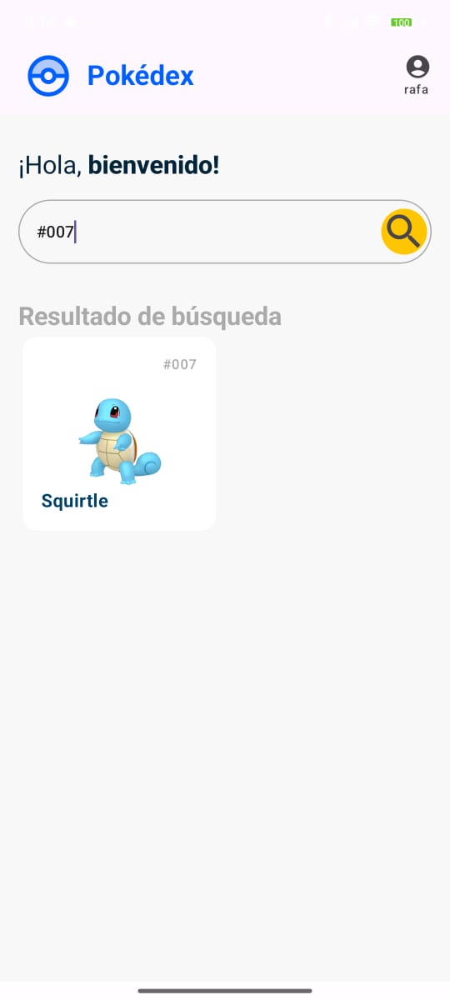
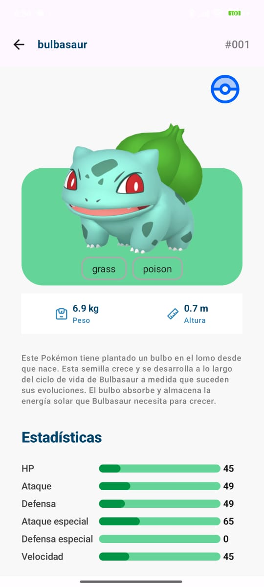
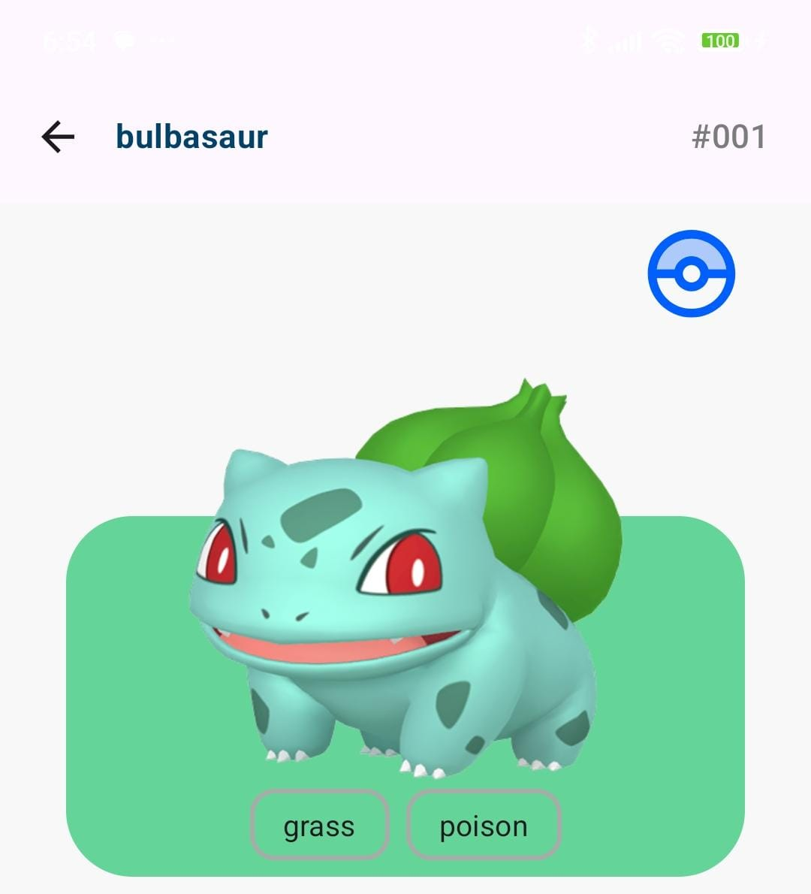
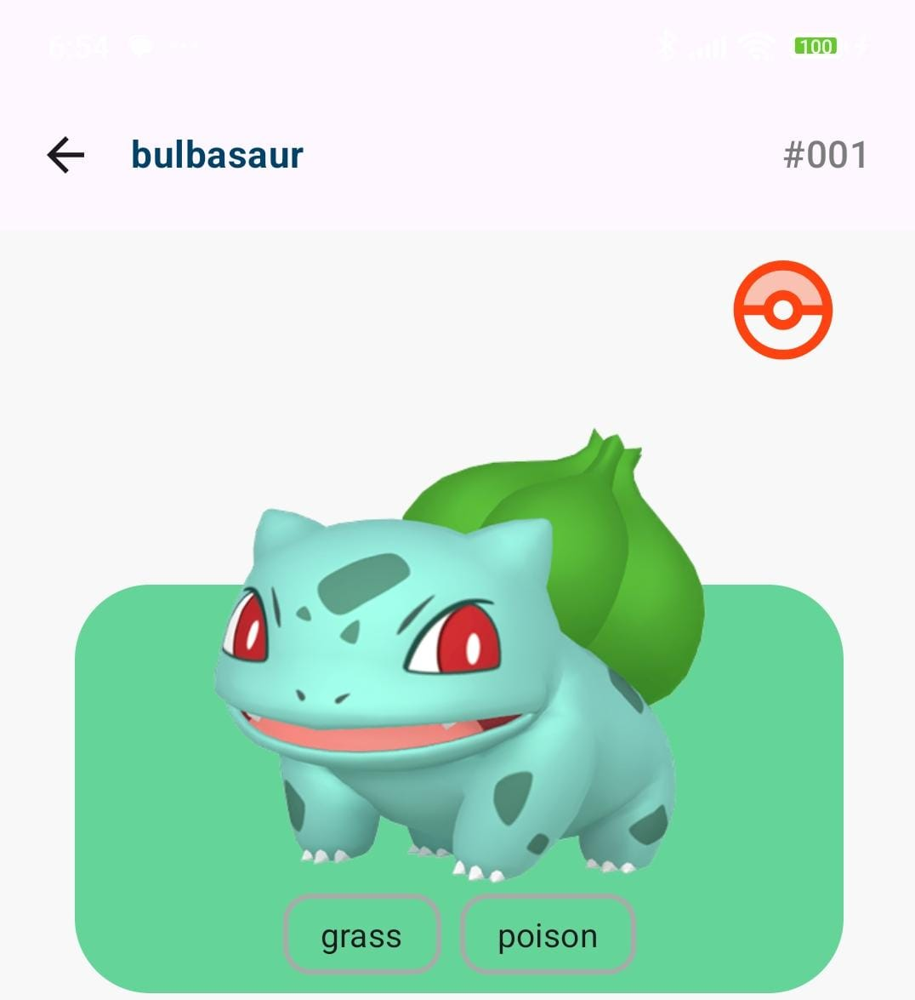
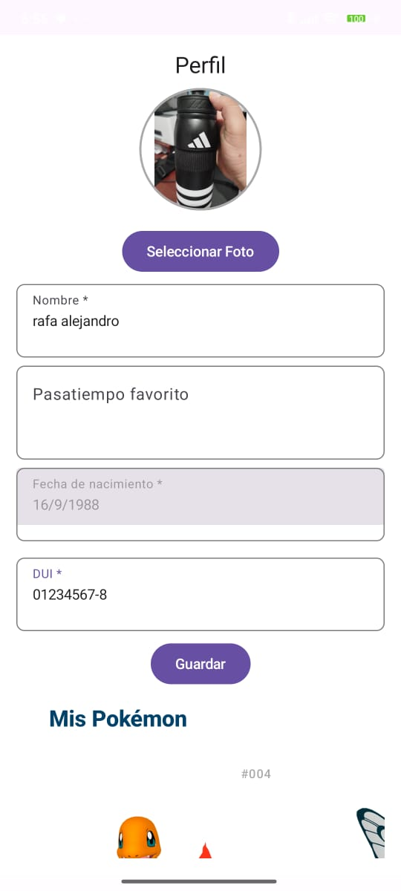
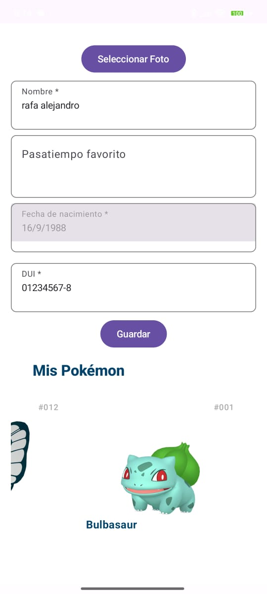

# Pokédex App – Jetpack Compose

Aplicación Android desarrollada con Jetpack Compose como prueba técnica. Permite visualizar un listado de Pokémon y acceder a sus detalles.

## 🛠 Requisitos

- Kotlin 2.0+
- Gradle JDK 21
- Conexión a internet (usa [PokeAPI](https://pokeapi.co))

## 🚀 Cómo ejecutar

1. Clona este repositorio:

   ```bash
   git clone https://github.com/tuusuario/tu-repo.git

2. Abre el proyecto en **Android Studio**.

3. Espera a que se sincronicen las dependencias (Gradle).

4. Conecta un dispositivo físico o inicia un emulador.

5. Haz clic en **Run**.

6. También puedes generar el APK desde: **Build > Build Bundle(s) / APK(s) > Build APK(s)**

## 📝 Notas

- No se requiere configuración adicional.
- La app utiliza datos en tiempo real desde la [PokeAPI](https://pokeapi.co).

## 📷 Capturas de pantalla

### Home

  
  
### Busqueda

   
  
### Información de pokemon

  

### Captura el pokémon y hazlo parte de tu equipo

   
  
### Perfil

  
  
### Mi equipo

  
